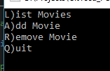
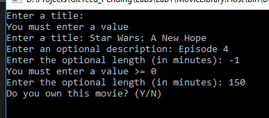
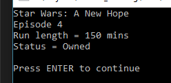
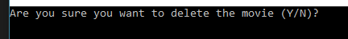

# Lab 1 (ITSE 1430)

In this lab you will create a simple movie collection program. For this lab you will collect information about a single movie. Later labs will expand it
to support multiple movies.

## Creating the Project

Create a new console project to hold your code.

1. Open Visual Studio.
2. Create a new project.
    1. Select the ```Console App (.NET Framework)``` project template.
    2. Ensure the ```.NET Framework 4.6.1``` option is set.
    3. Set the project name to *Name*```.MovieLib.Host``` where *Name* is your name (no spaces).
    4. Set the solution name to ```Lab1```.
    5. Ensure the location is under your ```Labs``` folder in your local Git repository.
    5. Create the project.
3. Commit the changes to Github to verify everything is correct.

## Create the Main Menu

Console applications typically have a menu to allow the user to interact with the system. Our application will allow the following options.

- List the movies
- Add a new movie
- Remove an existing movie
- Exit the application

Create a menu to display the available options. Until the user selects the option to exit, keep displaying the menu and performing the requested action.

*Note: You may use either letters or digits to provide access to your menu. If you use letters then ensure they are case insensitive.*



## Representing a Movie

For this lab there will be a single movie. Create appropriate variables to store the movie information. Whenever the lab mentions a movie, use the created variables.

A movie is defined to have the following fields.

Name | Type | Required | Comments
---- | ---- | -------- | --------
Title       | Text | Y | Unique title of the movie.
Description | Text | N | Optional description of the movie.
Length      | Integer | N   | Length of the movie in minutes (default to 0). If specified then it must be >= 0.
Owned       | Boolean | Y	| True if the movie is owned or false if it is on the wishlist.

## Adding a Movie

Prompt the user for each piece of information about the movie. For each field, perform any required validation and keep prompting the user until the appropriate information is provided.

Since this lab accepts a single movie, if there is already a movie then overwrite it with the new information.



*Note: The requirement for a unique movie title is not relevant for this first lab.*

## Listing the Movies

Display the movie information.  Each value should be displayed on its own line with a label indicating what it represents. Be sure that the display is readable (i.e. no typos or spacing issues).

If there are no movies then display “No movies available”.



## Remove a Movie

Prompt the user to confirm they want to delete the movie. If they confirm the deletion then clear the movie information.



*Note: It is up to you to decide how to determine whether a movie has been "deleted" or not.*

## Quit

Exit the program.

## Test Scenarios

- Listing movies when none are entered shows nothing.
- Listing movies when a movie exists shows the correct information.
- Adding a movie properly validates the data.
- Adding a movie when one already exists overwrites the existing data.
- Removing a movie when no movie exists does nothing.
- Removing a movie when a movie exists and then listing the movies.
- Exiting the program terminates it.

## Requirements

- Compile cleanly with no warnings or errors.
- Meet all the points mentioned in the solution.
- Ensure each file has a file header indicating the course, your name and date.
- Solution, project and code should be uploaded to Github.
- Submit lab in MyTCC by providing link to Github URL.


