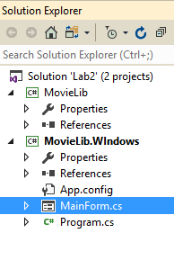
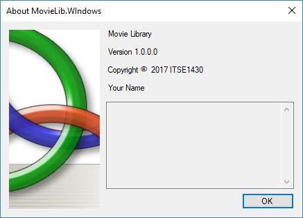
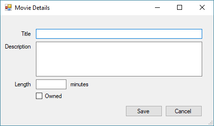

# Lab 2 (ITSE 1430)

In this lab you will migrate the previous lab to Windows Forms. In addition you will be adding a formal object oriented design to the code. Unless otherwise stated, all requirements from the previous lab will remain in force.

As with the previous lab, this lab will only support a single movie but this code will be the basis for multiple movies (and database persistence later). Therefore whenever the lab calls for "saving" this is referring to you updating the movie reference you are maintaining.

*Note: Code reuse is an important part of programming. Feel free to copy and reuse any code from the previous lab that you can.* 

## Setting Up the Solution

This lab will form the basis for all subsequent labs and therefore will be set up to support future requirements.

- Create a new project for the application.
    - Select the project template ```Windows Forms App (.NET Framework)```.
    - Ensure the framework version is set to ```.NET 4.6.1```.
    - Set the project name to *name*```.MovieLib.Windows``` where *name* is your name (Pascal cased).
    - Set the solution name to ```Lab2```.
    - Ensure the destination path is under the ```Labs``` folder of your repository.
- Rename the ```Form1.cs``` file to ```MainForm.cs``` as this will be your main window.
- Create a new project for the business layer.
    - Select the project template ```Class Library (.NET Framework)```.    
    - Set the project name to *name*```.MovieLib```.
- Remove the ```class1.cs``` file from the project.
- Add a reference to the business project from the application project.
- Build the code to ensure everything is correct.



## Movie Class

The information about a movie will be stored in a ```Movie``` class. The class represents a business object and should be in the business project. Ensure the class is public so it accessible outside the project. Ensure the class is properly doc commented.

The class will provide properties for the information that is needed by the application. Fields will be used to store the underlying data but not accessible outside the class.

For review, a movie will consist of the following information

Name    |   Type    | Required | Comments
------- |-----------|----------|---------
Title   |   Text    |	Y  | Unique title of the movie.
Description |   Text    |   N   | Optional description of the movie.
Length  |   Integer |   N   | Length of the movie in minutes (default to 0). If specified then it must be >= 0.
Owned   |   Boolean |   Y   | True if the movie is owned or false if it is on the wishlist.

### Saving the Movie

To keep things simple, store an instance of the ```Movie``` class as a field of the main form. Pass the instance to any code that needs it. 

* Note: A null movie indicates a movie has not been added yet and/or it has been deleted. This is a valid situation that some commands will check for.*

## Main Form

The main form should be set up as follows.

- Should have a title of ```Movie Library (name)```.
- Should provide the standard minimize, maximize and close options in the caption bar.
- Should be 700 x 400 in size.
- Should have an empty content area other than the main menu.

### Main Menu

The following options will be available on the main menu. Ensure that you use descriptive menu field names so they are easy to identify in code.

- File
    - Exit
- Movies
    - Add
    - Edit
    - Delete
- Help
    - About

## Commands

A command is a series of actions to take when executed. The following commands are defined for this application.

### File \ Exit

Close the application.

### Movie \ Add

Display the ```Movie Detail``` form. The form should start out empty. If the user selects the ```OK``` option then set the form’s movie to the new movie otherwise do nothing.

### Movie \ Edit

If there is no movie defined yet then display an error message. Otherwise display the ```Movie Detail``` form. The form should display the values of the form’s movie. If the user selects the ```OK``` option then update the form’s movie to the new, edited movie otherwise do nothing.

* Note: Copy the existing movie details into a temporary movie object while editing. If the user decides to cancel the editing or if they attempt to save the changes and validation fails then you do not want to have the form corrupt the original movie data.*

### Movie \ Delete

If there is no movie defined yet then display an error message. Otherwise display a confirmation message that includes the movie title. If the user selects ```Yes``` then clear the form’s movie. If the user selects ```No``` then do nothing.

### Help \ About

Display the About form.



*Note: Visual Studio ships with a file template that will auto-generate this for you.*

## Movie Detail Form

This is the form that is used to add new movies and edit existing movies. The form is responsible for verifying any movie data before it is saved.

The form will consist of the following.
- A Label and TextBox for providing the title of the movie. Provide enough space for a title (assume an average of 50 characters).
- A Label and TextBox for providing the description of the movie. Use a multiline field that allows at least 3 lines of text.
- A Label and TextBox for providing the length of the movie. Provide enough space for the length (assume 90 to 240 minutes). Make it clear that the length is in minutes.
- A Label and CheckBox for indicating if the movie is owned or not.
- A Button to save the changes.
- A Button to cancel the changes.
- A reasonable title such as ```Add Movie``` or ```Edit Movie```.
- A reasonable default size.

For all fields ensure the labels line up as do the controls in a reasonable fashion. Ensure the tab ordering is set such that the user can tab between each of the fields. The buttons should be grouped at the bottom together. Use reasonable names for the interactive fields.



When the form loads, if a movie is associated with it then the details of the movie will be filled into the fields on the form. Otherwise the fields will be empty.

* Note: Forms should not expose their controls to callers. When dealing with data input forms it is generally best to provide a get/set property to allow the data to be set and retrieved as an object. The caller is responsible for initializing the property.*

When the Save button is selected then validate the fields (as defined later). If the fields are valid then save the values to either the movie that was provided or a new movie. Then close the form. If the fields are invalid then display an error and return to the form.

When the Cancel button is selected then close the form without saving any changes.

Ensure when returning from the form that the appropriate dialog result is returned so the parent form can react accordingly.

### Movie Validation

The following rules should be enforced when validating the movie.

- Title cannot be empty.
- Length must either be empty or a value >= 0.

*Note: These are the same rules as in the previous lab.*

## Test Scenarios

- Adding a movie shows an empty form.
- Adding a movie validates the data.
- Cancelling a movie while adding does not do anything.
- Editing when no movie exists displays an error.
- Editing a movie when one exists displays the correct information.
- Editing a movie, making changes and cancelling does not modify anything.
- Editing a movie and saving changes modifies the movie.
- Deleting a movie and cancelling the confirmation does not delete the movie.
- Deleting a movie and confirming the deletion removes the movie.
- Exiting the program terminates it.

## Requirements

- Code compiles cleanly without warnings and errors.
- Each file has a file header.
- Public types and members have doctags.
- All code uploaded to Github.
- Lab submitted using MyTCC.
