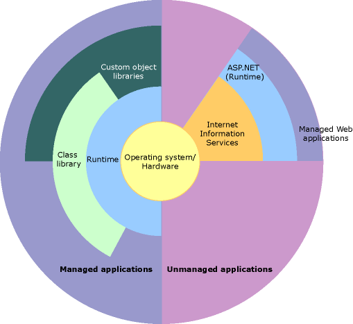

= .NET Runtime
Michael Taylor <michael.taylor@tccd.edu>
v1.0
:toc:

C# the language was written to demonstrate the abilities of .NET the framework. \.NET is a combination of runtime and framework library for running applications. It is impossible to study C# without also studying .NET. No other language exposes such a low level view of the runtime as C#. 

== .NET Architecture

Architecturally .NET looks like this.

At the center is the operating system (OS). The operating system is responsible for managing overall system security, memory allocation, process and threading control and providing access to other devices such as the file system.

The .NET runtime itself sits on top of the OS and provides the core services for .NET applications. All .NET applications run inside a sandbox called the Common Language Runtime (CLR). The CLR acts as a sandbox to keep applications isolated. It also acts like a virtual machine providing virtualized services such as threading, security and memory management. All the functionality is ultimately virtualized over the OS.

On top of the CLR is where .NET application, known as managed applications, runs. Each application can be written in a different language. This is what makes .NET different than other platforms. Every .NET compatible language runs on the .NET runtime, not on a language-provided runtime. This means that at the point of compilation the source language of the application no longer matters. This allows code written in one language (such as C#) to call into code written in another language (such as Visual Basic) without either side knowing or caring about the original language. It all gets normalized at the point of compilation.

== Platform Agnostic

One of the big benefits of managed applications is that they are compiled but run on the equivalent of a virtual machine. Therefore you can compile your code once and it can run on any platform that supports .NET without recompiling. Today that includes Windows, Linux and MacOS.

== Language Agnostic

A very big benefit of .NET is that it is also language agnostic. The runtime does not care what programming language is used to write code. Provided the language supports .NET it can work with any other .NET code. 

This was unheard of back in the beginning days of .NET. At the time if you had written code in a library you needed to expose a "C" style function so it could be called by other code or by the operating system. That was because each language had its own runtime, calling convention and rules for how data was stored. With .NET all this goes away. All languages use the same conventions, follow the same memory models and overall behave following the same rules. This means you can write your code in the language most appropriate for the problem you are trying to solve rather than the language that is supported by all parts of your solution.

A consequence of this is that .NET is language agnostic. As a compromise the runtime may use terminology that differs from your language of choice. It is up to each language to handle the conversion. But this becomes noticeable when calling into the runtime for certain things. For example here is how you might convert a string to a 4-byte floating point value.

[source,csharp]
----
float rate = Single.Parse("1234.567");

int hours = Int32.Parse("55");
----

The C# type for 4-byte floating point is `float` but for the runtime it is `Single` which comes from Visual Basic. A 4-byte signed integral in C# is called an `int` but it is called `Integer` in Visual Basic. However the runtime uses the bit-size equivalent which is `Int32`. 

All languages use the underlying primitive types of the runtime. So the above code could also be written as this.

[source,csharp]
----
Single rate = Single.Parse("1234.567");

Int32 hours = Int32.Parse("55");
----

Languages like C# use type aliasing to convert from a language-friendly name, `int` to the runtime equivalent `Int32`. This happens at compilation and has no impact on the generated code. `int` is the C# type and `Int32` is the formal type.

Unless otherwise stated always use the language-specific type alias for primitives. The only time the formal names are used is in languages that do not have equivalent types and when referring to the type in a formal manner (such as when calling `Parse`).

== Just In Time Compilation

While technically the .NET runtime is a virtual machine, .NET applications are not interpreted. An application is compiled to MSIL, the assembly language of the virtual machine. This is no different than a C++ program being compiled for an x86 machine. 

At runtime the MSIL is "just in time" compiled (JITted) to the target machines assembly language before it executes. This has many benefits including the ability to take advantage of target platform features that were not available when it was originally compiled. However compilation is slow so the runtime goes through many hoops to ensure that compilation does not slow down the program while it runs. In most cases managed code outruns the equivalent C++ code.

== Runtimes

Today there are 3 .NET runtimes supported by Microsoft.

.NET Framework::
The original framework designed for Windows. It is the most feature complete but evolves slowly given the decades worth of code written for it.
.NET Core::
The re-envisioned version of the framework that is smaller and faster. It is designed for Windows, Linux and MacOS. Unfortunately it does not have all the same features because of cross platform concerns. 
.NET 5::
This is the next generation of the platform expected to go live in Nov 2020. It is built in .NET Core but with the compatibility of .NET Framework.

When you design to build a .NET application you currently have to decide which platform to use. Some applications cannot currently be built with .NET Core but .NET Framework only supports Windows. .NET 5 is supposed to solve this problem but it is still in early access. Ultimaely .NET 5 will be the platform going forward with .NET Framework and .NET Core going away.

For purposes of C# only a few of the newest language features are not available on .NET Framework. The language itself supports any of the above platforms.

== Assemblies

In .NET an `assembly` is a binary containing .NET code. Applications may have a `.exe` extension while libraries may have a `.dll` extension but .NET sees them both as assemblies. An assembly is a deployable unit. When creating a project in Visual Studio each project produces its own assembly.

Assemblies allow code to be shared without worrying about problems like compilation or language compatibility. All functionality exposed by the runtime and used by the language comes from assemblies that are part of the framework. In most cases you will not care about the details of where the functionality resides but later on you will learn how to use functionality defined in new assemblies.

The only limitation that Visual Studio puts on assemblies is that they must be written in the same language. Once compiled the source language is not relevant for the assembly. Assemblies written in C# call assemblies written in Visual Basic using the same syntax and protocols as those written in C#.
