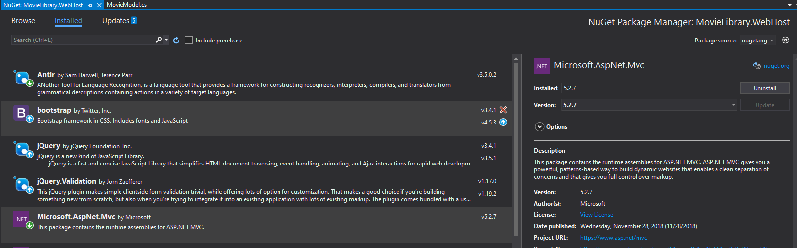
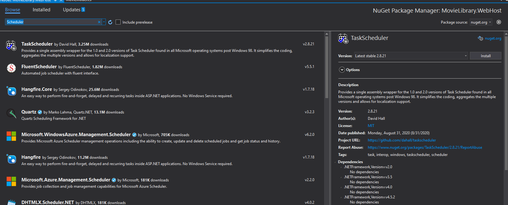
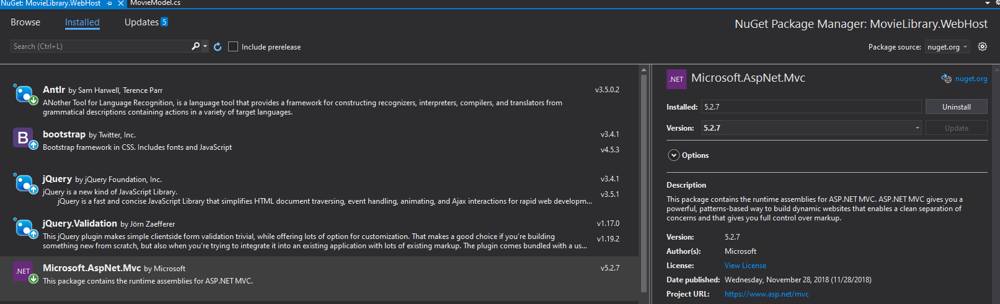
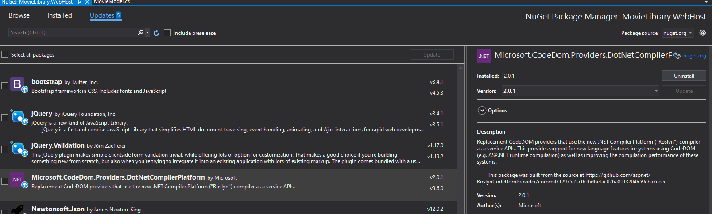
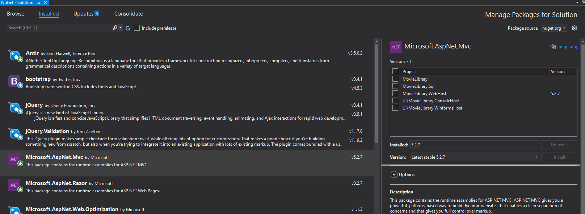
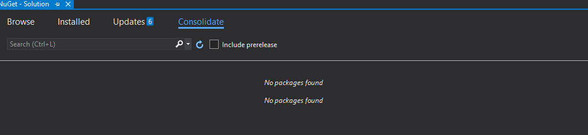

= Package Management
Michael Taylor <michael.taylor@tccd.edu>
v1.0
:toc:

Software reuse is critical for building reliable applications quickly.
It is unrealistic to assume that all the functionality needed to implement an application should be written directly.
This is error prone, unsecure, untested and slow.
There are thousands of developers writing reusable components all over the world.
The challenge is finding these components and integrating them into an existing application.

For this section assume an application needs to provide a scheduler for users to schedule meetings.
While the application could implement this logic it would be very time consuming so the team has decided to look for an existing component.

== Code Reuse

Code reuse can occur using any of a number of approaches.

=== Copy Paste

Copy/paste is commonly used for small blocks of code.
In this approach the code, generally type types and/or methods, is physically copied into the existing application code.
For small blocks of code, such as a function to calculate a value, this is reasonable but for any arbitrarily complex component this quickly becomes unmanageable.

The advantages of this approach include:

- Simple.
- Runtime performance should be comparable to other code in the application.
- Code can be adjusted to more easily fit into application or fix issues.
- Visiblity into behavior of code.

The disadvantages of this approach include:

- Codebase gets larger as more code is copied.
- If issues are found in the original version then there is no easy way to update code that was copied.
- For some components this may require too much code to be realistically copied into the application.

=== Shared Libraries

Shared libraries are the primary reusable components in use today.
A component is created using whatever packing mechanism is used by the language or platform, for example a DLL or ZIP file.
The component is then "installed" into the application code.
The component can then be used by the application.

The advantages of this approach include:

- Fast to integrate in most cases.
- Depending upon the tools used it is generally easy to get notifications about updates to a component.
- Keeps the code base small since the component is already separated out.

The disadvantages of this approach include:

- No easy visibility into the component and what it is doing.
- Some tools require installing software which can be an issue if developers do not have sufficient rights.
- Possible to distribute malicious components that may be hard to detect.

== Package Management

Package management is the process of managing the packages, the components, that an application relies on.
Historically to use a component a developer would need to install some sort of development kit, SDK. 
This often required administrative privileges and modification of environment variables so the build tools would find the component.
Additionally it made it harder to configure standalone build machines since all the required software would need to be installed in advance.
This also made onboarding new developers difficult.

Package management alleviates this issue by moving all components into discoverable packages.
A package is simply a component and the metadata needed to find and integrate it with an application.
Packages are generally downloaded during the build process and do not require additional rights making it easy to use on build servers or on a new development machine.
Furthermore package management systems often provide a way to discover available packages making it easier to find a component that may be needed.

NOTE: In most cases package management is a build time only feature. At runtime dependencies are already available just like other dependencies that do not use package management.

One of the big advantages of package management is that packages often have their own dependencies.
Package management allows your code to specify what it depends on and package management will handle referencing any additional packages needed as well.

== NuGet

In .NET https://nuget.org[NuGet] is the package management system that is used.
While you can work with https://nuget.org[NuGet] from the command line it is generally easier to use Visual Studio.

Each project has its own list of packages it relies on.
Some projects may have no dependencies while others may have many.
Each dependency is listed in the project references as a https://nuget.org[NuGet] package.
The package(s) are automatically downloaded during the build process and are immediately available for use.

The process works something like this.

. At some point after a solution is open all the packages that a solution relies on are downloaded if they have not yet been downloaded.
. When a build is started the build system waits for all packages to be downloaded.
. Package dependencies are treated as binary referenes such that the compiler can find the necessary code at compilation.
. In most cases the package binaries are copied into the output directory of the project so they are accessible at runtime.

== Package Management UI

To view the packages a project depends on right click the project in `Solution Explorer` and select the `Manage NuGet Packages` option.
This brings up the `Package Management` UI.

!

There are several tabs in this UI.

Browse ::
   This tab allows you to search for packages to install.
Installed ::
   This tab shows the packages that are installed for this project.
Updates ::
   This tab shows the packages that need to be updated to newer versions.

=== Searching for Packages

To add a new package, component, to a project use the `Browse` tab to search for a package.
Type a simple name to search for available packages.

!

In the results is a list of available packages, generally sorted by popularity.
The current version is shown for reference.
On the right side is information about the package including:

- The author.
- The current version.
- A link to the Github repository or website if there is one.
- Licensing information.
- Dependencies that the package has.

WARNING: Always use packages only from trusted authors. It is possible to find malicious packages in NuGet.

To "install" a package to the project use the `Install` button.
This will add the package to the project references so it can be used.

=== Managing Packages

The `Installed` tab shows the packages a project depends on.

!

For the most part it shows the same information as the `Browse` tab. 
However it also show the current version of the package being used and, if there is an update, an option to update to a newer version.
Additionally a package can be removed from the project from here.

WARNING: You cannot remove a package from a project if it is needed by another package in the same project.

=== Updating Packages

Over time packages will get updated to newer versions.
Newer versions can break existing code but this is generally bad.
In general a minor version update, for example from 1.2 to 1.3, is safe.
A major update, for example from 1.0 to 2.0, may have breaking changes.
Refer to the release notes for the package for information.

Because updating a package may break code it is not done automatically.
The `Updates` tab shows if there are any updates available for packages.

!

This tab shows the currently installed version and the latest available version.
From here select the desired version and click `Update` to update the package.
In some cases it might be necessary to downgrade a package as well.

CAUTION: You should always keep your packages up to date to ensure code and security fixes are available. Outdated packages are a very common loophole that hackers take advantage of.

== Solution Wide Packages

Each project has its own set of package dependencies but it is common to have some packages used in multiple projects. 
In this case it is critical that all projects use the same version of the package.
Failure to do so can result in unexpected runtime errors.

To make this easier to manage you can also view all the packages used in all projects in the solution.
To do so right click the solution node in `Solution Explorer` and select `Manage NuGet Packages for Solution`.
The package management UI is almost identical to the version used for a project with two exceptions.

The first difference is that each tab now shows the list of projects as well.

!

While the behavior is the same it is now necessary to select the project(s) to apply the changes to.
Additionally when looking at installed packages it is easy to see what version each project relies on.

NOTE: It is generally easier to work in the solution package management UI then the individual project UIs.

The second difference is the new `Consolidate` tab.
As mentioned earlier it is critical that all projects in a solution rely on the same version of a package.

!

The `Consolidate` tab shows all projects that have mixed package versions.
From here you can sync up all projects to use the same package version.

== See Also

link:readme.adoc[Web Development] +
https://nuget.org[NuGet] +
