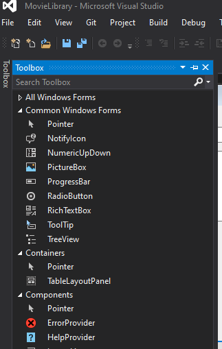
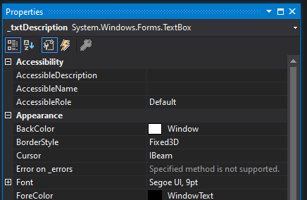

= Chapter 4: Windows Forms
Michael Taylor <michael.taylor@tccd.edu>
v1.0
:toc:

The Windows Forms Designer in Visual Studio is a WYSIWYG designer allowing you to graphically build your form without having to write the corresponding code.
To open the designer double click the form's `.cs` file in Solution Explorer. 
The IDE will automatically open the designer.
To open the source code instead either right click the file in Solution Explorer and select `View Code` or right click in the designer on the form and select `View Code`.

CAUTION: When using .NET Core be aware that the Windows Forms Designer is in preview and has limitations. If there is a need for a lot of graphical design then it is recommended that you create a temporary .NET Framework project (or change the existing project) and create the form there. Then move the files to the .NET Core project.

One of the benefits of the designer is that you can make most changes in the UI without having to write code.
Behind the scenes the designer will auto generate the corresponding code.

== Adding Controls

To add a control to the form go to the `Toolbox` window.
From the `Toolbox` drag and drop any of the controls onto the form's surface.

!

CAUTION: The `Toolbox` is context sensitive. If a form is not the active object in the editor then you will not see any controls.

The control will be placed on the form in the location requested.
If a control is a component then it will be placed in a component window at the bottom of the form.

To select a control single click on it within the form. 
The designer will draw a selection box around it.
To select multiple controls left click hold somewhere above and to the left of the controls to be selected and then draw a selection rectangle around the controls.
Release the mouse button to select all controls in the selection box.

To move a control first select it.
Then left drag the control to another location.

Some controls allow resizing. 
To resize a control first select it.
Then use the resize bars on the sides to resize it horizontally, vertically or both.

To remove a control first select it.
Then either right click and select `Delete` or press the `Delete` key.

== Editing Control Properties

To edit the properties of a control use the `Properties` window.
The `Properties` window shows the available properties (or events) for the currently selected object in the editor.
This may be a form, a child control or any other file.

!

The `Properties` window has three sets of buttons.
The first set controls whether properties are shown alphabetically or grouped by area.
The second set of buttons determine whether properties or events (the lightning bolt) are shown.

NOTE: Ensure the properties are shown when editing properties. Use the `Events` button when working with events.

At the top of the property window is a dropdown list of available objects to edit.
Selecting an object in the designer sets this.
Alternatively the dropdown list can be used to select an object directly.

Within the `Properties` window the properties are shown on the left with an editable field on the right.
Changing the value will set the corresponding property.
Depending on the property the value may be a simple text value, a numeric value or another object.
Some property values display a drop down list when selected.
For other properties selecting the value shows an edit icon (`...`) that can be clicked to load an editor.

NOTE: If a property's value is in bold then it has a value other than the default.

When changing a property's value the editor will validate the value.
If an error occurs then an error message is shown and the value is not changed.

=== Smart Tags

When some controls are selected a small arrow may appear in the top right corner.
This is the smart tag icon.
A smart tag can be clicked and a popup will appear.
Within the popup is a set of common tasks that may be performed on the control such as setting the text, adding items or docking the control.
When supported the smart tag can be used in lieu of the `Properties` window.
There is no difference.

== Renaming a Control

All controls have a https://docs.microsoft.com/en-us/dotnet/api/system.windows.forms.control.name[Name] property.
The `Name` property is used to programmatically find the control at runtime.
This is most useful when dynamically building UIs.
However this property also serves another purpose.

NOTE: The `Properties` window shows this property as `(Name)` under the `Design` category.

When a control is dropped onto the form from the `Toolbox` the designer automatically creates a backing field for the control.
The backing field uses the same value as the `Name` property for convenience.
Because it is used for the backing field the `Name` must be a valid identifier and must be unique within the parent form.

NOTE: Always use the backing field to work with controls that are known at compile time. It is simpler, faster and easier to read.

In general controls that will be used programmatically, such as input controls, should have readable field names.
To rename a control you can do one of the following.

- Find an instance of the field in code and symbolically rename it like any other identifier.
- Change the `Name` property in the `Properties` window.

Either approach symbolically renames the backing field and changes the `Name` property in the designer.

== Handling Events

Besides setting properties it is common to react to events of the controls on a form.
Handling an event of a control can be done in several different ways.

- For the default event of a control, generally `Click`, double click the control in the designer.
The designer will auto generate the method and hook up the event handler.
- For other events switch to the `Events` view in the `Properties` window, find the event and type in an event handler name. The designer will auto generate the method and hook up the event handler.
- Create the method in code. Then go to the `Events` view in the `Properties` window, find the event and select the method name from the dropdown list. The designer will automatically hook up the event handler.
- Create the method in code. Then hook up the event handler in code to the event.

When double clicking a control, if an event handler is already set up then the designer will jump to it in the code.

CAUTION: Be very careful about double clicking in the designer because it will automatically generate event handlers.

== InitializeComponent Method

The `InitializeComponent` method is auto generated when adding a `Windows Form` file to a project.
This method is contained in the `.designer.cs` file of the form.
This method contains all the code generated by the designer and ensures when the form instance is created it matches what the designer shows.

CAUTION: Do not edit this method or open the `.designer.cs` file. Doing either can cause the IDE to get confused and wipe the entire form contents.

The default constructor for the form calls this method.
When creating new constructors either ensure the default constructor is called or call this method explicitly otherwise the form will be empty.

There is nothing special about this method.
When not using the designer this method is neither created nor needed.
The purpose of this method is to keep the designer-generated code away from user-generated code.
This helps reduce the likelihood of messing up the designer.

If you look at the contents of the `InitializeComponent` method it does the following.

- Define a field for each control in the designer.
- Initialize each field to a new instance.
- Set the properties of each control based upon the changes made in the `Properties` window.
- Initialize the form properties.
- Associate each control with its parent, or the form.

All this can be done programmatically if necessary but the designer is easier to use.

== Designer Errors

The designer has to compile and instantiate the form to show it in the IDE. 
That means the constructor and the `InitializeComponent` methods are run in the context of the designer.

CAUTION: Do not perform any runtime logic, such as retrieving data from a database, inside the constructor of the form. This code gets run in the designer and will not work properly.

In some cases the designer may fail to load.
In these cases it will show an error and give the option to jump to the code.
Clicking the `Go to Code` link will jump to the line in `InitializeComponent` containing the error.

At this point the compiler error has to be fixed. 
The most common error is a missing identifier.
This happens when a field is renamed manually instead of symbolically.
It can also happen if an event handler is generated and then renamed manually or if it is deleted.
To fix these errors either fix the identifier name or remove the line.

In the case of an extra event handler the easiest fix is to restore the event handler in code.
Then go to the `Properties` window in the designer, go to the `Events` tab and then delete the method name from the event.
In some cases the designer will automatically delete the corresponding method if it is empty.
Otherwise the method can be deleted manually.

CAUTION: Be very careful about editing this file. Any mistakes can cause all the code in the method to be removed. At this point it is generally better to restore the unmodified version instead of trying to recreate it.

Once the errors are fixed and the designer loads be sure to close the `.designer.cs` file. 
Leaving this file open while the designer is open can cause a race condition that corrupts the file.
It is not necessary to save the file contents first because the designer has a copy as well.

== See Also

link:readme.adoc[Windows Forms] +
link:controls.adoc[Controls] +
link:form-layout.adoc[Form Layout] +