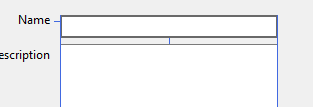
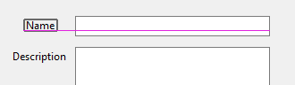

= Form Layout
Michael Taylor <michael.taylor@tccd.edu>
v1.0
:toc:

Windows forms is limited to simple layouts but still has enough flexibility to build most layouts that might be needed in a line of business application.
Layouts can be complicated to get correct and often require a combination of techniques.

NOTE: A full discussion of good layouts is beyond the scope of this topic.

== Alignment

Alignment is the simplest of the layout approaches.
Alignment is most easily done using the designer.
Alignment involves lining up controls in a form so they are visually appealing.

In a typical form controls tend to line up in columns of data.
For example labels tend to be above or to the left of input controls.
If there are too many controls to show then an expander may be used to allow additional controls or multiple columns may be used instead.
In all these cases the labels and controls should align horizontally and vertically to make for a more clean UI.

To align controls use the designer to select the control to be moved. 
Left click drag the control on the designer.
As the control gets closer to another control blue alignment lines will be drawn.

!

The blue lines on the left, right top and bottom help align the controls horizontally and vertically.
The small blue line between the controls indicate that the controls are the "proper" distance apart when following the Windows UX guidelines.

=== Aligning Text

One problem with horizontal alignment is that font size and family impact alignment when working with labels and other text controls.
While a label and its related control may be horizontally aligned it will visually still be wrong because of font settings.

Each font family is drawn according to a baseline.
The baseline is an invisible line, like on lined paper, that the font is written to.
Most letters will be above the baseline.
A few letters, like `p` and `q`, may hang below the baseline.

When aligning text with controls the baseline should be used instead of horizontal alignment. 
Visually this makes the controls appear aligned.
When aligning controls a magenta line may appear.
This is the baseline.
When the baseline appears the controls are aligned visually even if they do not actually aling horizontally.

!

== Tab Ordering

Setting the correct tab order is important for navigating a form with the keyboard.
While some users will use the mouse for everything most users use the mouse to get to the start of the controls and then press `Tab` to navigate to other controls.

The tab order determines the order in which controls are tabbed.
It is a zero-based index.
When the user presses the `Tab` key Windows moves to the next control in tab index order.
If multiple controls have the same tab index then whichever one Windows finds first wins.

The https://docs.microsoft.com/en-us/dotnet/api/system.windows.controls.control.tabindex[TabIndex] property on the https://docs.microsoft.com/en-us/dotnet/api/system.windows.controls.control[Control] class controls the index. 
Normally this property does not need to be set directly.
As controls are added to the form then the property is set automatically by the designer.
However if controls are moved around or added out of order then the index will be wrong.

To fix the ordering use the designer.

. With the form open in the designer go to the `View` menu.
. Toward the bottom is the context sensitive `Tab Order` option.
. Once clicked the designer shows a number after each control. This number is the current tab index.
. To change the tab order click the controls in the order they should tab. The designer will adjust the tab index.
. Once done press `Escape` to exit ordering mode.

All controls have a tab index but not all controls use it.
https://docs.microsoft.com/en-us/dotnet/api/system.windows.forms.label[Labels], for example, are not part of the tab order.
The https://docs.microsoft.com/en-us/dotnet/api/system.windows.forms.control.tabstop[TabStop] property determines whether a control can be tabbed to.
https://docs.microsoft.com/en-us/dotnet/api/system.windows.forms.label[Labels], by default, have this set to `false`.
Other controls may do this as well.

== Positioning

By default when Windows shows a window it starts in the top left corner.
Each subsequent window is shown offset to the right and down.
This results in a cascading effect but allows the user to open many windows at one time and still be able to access each window's caption area.

For top level windows this behavior is fine but for child forms it generally makes more sense to show the form centered in the parent.
To center a form in its parent use the https://docs.microsoft.com/en-us/dotnet/api/system.windows.forms.form.startposition[StartPosition] property on the form.
Set it to https://docs.microsoft.com/en-us/dotnet/api/system.windows.forms.formstartposition[FormStartPosition.CenterParent] to center it on the parent.

NOTE: For this to work ensure the parent is set when displaying the form.

== Resizing

The initial size of a form is controlled by the https://docs.microsoft.com/en-us/dotnet/api/system.windows.forms.size[Size] property.
This can be set in the designer by resizing the form.
At runtime forms can be resized by default using the same approach on the actual form.
In general this is a good UI because users can make it larger or smaller to meet their screen resolution.
But some forms, like input forms, may not look correct if resized.

To prevent resizing set the https://docs.microsoft.com/en-us/dotnet/api/system.windows.forms.formborderstyle[FormBorderStyle] to a non-resizable value.
Alternatively you can also set the https://dos.microsoft.com/en-us/dotnet/api/system.windows.forms.minimumsize[MinimumSize] and https://docs.microsoft.com/en-us/dotnet/api/system.windows.forms.maximumsize[MaximumSize] properties to the current value of https://docs.microsoft.com/en-us/dotnet/api/system.windows.forms.size[Size]. Windows will still show a resize prompt but will not allow the form to be resized.

.Prevent Resizing
[source,csharp]
----
void Configure ()
{
   FormBorderStyle = FormBorderStyle.Fixed3D;

   //Or
   MaximumSize = MinimumSize = Size;   
}
----

NOTE: This is normal done in the designer.

== Anchoring

When a form is resizable it is important to ensure that the child controls behave properly.
Two issues can occur when resizing.

- If the form is made too small then controls may be hidden.
- If the form is too large then there is a lot of blank space in the form.

For the former it is generally best practice to set the https://dos.microsoft.com/en-us/dotnet/api/system.windows.forms.minimumsize[MinimumSize[MinimumSize] property of the form to the minimal size the form should get.
This may be the default size of the form.

For the latter case it is necessary to either move or resize the controls as more (or less) horizontal or vertical space is available.
While this can be done manually it is easier to use the https://dos.microsoft.com/en-us/dotnet/api/system.windows.forms.control.anchor[Anchor] property.

Think of the https://dos.microsoft.com/en-us/dotnet/api/system.windows.forms.control.anchor[Anchor] as a pin that holds the control in place.
The pin specifies the distance from the edge of the parent form to the control.
This distance cannot change by resizing.

The https://dos.microsoft.com/en-us/dotnet/api/system.windows.forms.control.anchor[Anchor] property can be a combination of: `Left`, `Right`, `Top` and `Bottom`.
The default is `Top, Left` meaning the distance from the top and left sides of the parent form remain the same.
Since form's are not normally resized in that direction the default does not have any real impact.

By setting the https://dos.microsoft.com/en-us/dotnet/api/system.windows.forms.control.anchor[Anchor] property to one of the other values a form can get the moving or resizing behavior desired.

- Setting both `Left` and `Right` causes the control to resize horizontally as the form gets wider or narrower.
- Setting both `Top` and `Bottom` causes the control to resize vertically as the form gets shorter or taller.
- Setting `Bottom` causes the control to move up and down as the form gets shorter or taller.
- Setting `Right` causes the control to move left and right as the form gets wider and narrower.

By using a combination of values controls can be moved and resized as needed.
For example a https://dos.microsoft.com/en-us/dotnet/api/system.windows.forms.textbox[TextBox] can get wider or shorter by setting https://dos.microsoft.com/en-us/dotnet/api/system.windows.forms.control.anchor[Anchor] to `Left` and `Right` allowing the user to have more room to type a longer value.
A multiline https://dos.microsoft.com/en-us/dotnet/api/system.windows.forms.textbox[TextBox] can have all four values set to allow it to grow wider and taller as the parent form is resized.

.Anchor Example
[source,csharp]
----
//Gets wider or narrower as parent form does
txtName.Anchor = Anchor.Top | Anchor.Left | Anchor.Right;

//Gets wider/narrower and taller/shorter as parent form does
txtDescription.Anchor = Anchor.Top | Anchor.Left | Anchor.Right | Anchor.Bottom;
----

NOTE: This is normally set through the designer.

=== Overlap

One issue that often arises with anchors is overlapping controls.
Windows Forms allows controls to overlap each other.
Suppose there is a multiline textbox on a form and below this textbox is a checkbox.
If the textbox expands horizontally and vertically with the form but the checkbox is anchored to the top, left then when the textbox gets bigger it will overlap the checkbox.

To handle this issue it is sometimes necessary to change the anchor of some controls so they move as well.
One approach to doing this is draw an imaginary line across the form at the point where controls will resize. All controls above this line anchor to the top, left while those below will anchor either to bottom, left or bottom, right.
If a form has many resizable controls then this will not work and a more elaborate layout is needed.

== Docking

A variant of anchoring is docking. Docking pins a control to the top, bottom, left or right side of a form.
When docking is used the control fills up the top/bottom or left/right margin of the parent form. 
An example of top docking is the main menu of most programs.
Bottom docking can be seen with windows that have a status bar.
Left and right docking are less common but Visual Studio supports all of them, plus more that are not supported in Windows Forms.

To dock a control set its https://dos.microsoft.com/en-us/dotnet/api/system.windows.forms.control.dock[Dock] property to the appropriate value.

.Dock Example
[source, csharp]
----
lvItems.Dock = Dock.Left;
----

NOTE: This is normally set through the designer.

When a control is docked the framework handles automatically resizing the control as the parent form is resized.

NOTE: If multiple controls dock on the same side then they are stacked.

=== Filling a Client

One special fill value is https://dos.microsoft.com/en-us/dotnet/api/system.windows.forms.dock[Dock.Fill].
When a control is set to this then the control takes up the entire client area of the parent form.
This is most commonly done in the main window when a grid control is used to show information to the user.

CAUTION: Docking is first come, first serve. Any control that is set to https://dos.microsoft.com/en-us/dotnet/api/system.windows.forms.dock[Dock.Fill] should be added to the parent form last otherwise it will overlap other docked controls.

== Containers

Even with the above options available there are still layouts that Windows Forms cannot render properly.
Windows Forms provides a few container controls that have no UI of their own but provide pre-defined layouts for any child controls placed in them.
They are used to build more complex layouts than was is possible with the earlier approaches.
Often containers are nested inside other contains and combined with the other layout approaches to produce the final UI.

.Common Containers
|===
| Type | Description
| https://docs.microsoft.com/en-us/dotnet/api/system.windows.forms.flowlayoutpanel[FlowLayoutPanel] | Lays out controls in a horizontal or vertical order. Useful for laying out buttons or columns of controls.
| https://docs.microsoft.com/en-us/dotnet/api/system.windows.forms.panel[Panel] | Simple grouping container, no layout.
| https://docs.microsoft.com/en-us/dotnet/api/system.windows.forms.splitterpanel[SplitterPanel] | Two panel container that has a resizable splitter in the middle. Windows Explorer is an example of a splitter window.
| https://docs.microsoft.com/en-us/dotnet/api/system.windows.forms.tablelayoutpanel[TableLayoutPanel] | Container for rendering a table of controls where the table has columns and rows. Complex container that allows a table-like structure.
| https://docs.microsoft.com/en-us/dotnet/api/system.windows.forms.tabpage][TabPage] | Container consisting of multiple "tabs" of contents where each tab is separate from the others.
|===

== See Also
link:readme.adoc[Windows Forms] +
link:form-designer[Form Designer] +
https://docs.microsoft.com/en-us/dotnet/api/system.windows.forms.control[Control Class] +