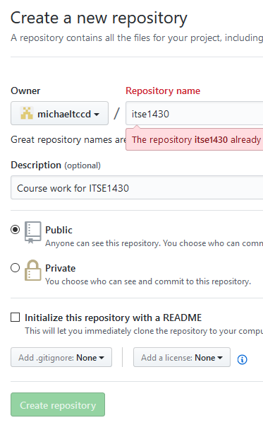

# Setting Up GitHub

This class uses [Github](https://github.com) for storing all class work and for submitting labs. You must setup a repository in order to complete the work in this class.

## Creating a Profile

If you do not yet have a Github account associated with your MyTccd email then do the following.

1. Go to [Github](https://github.com).
2. Enter a username (ex. Mynametccd). Note that the user name is generally part of the URL you will share so use a generic user name.
3. Enter your MyTccd email address.
4. Enter a password.
5. Click `Sign up for GitHub`.

## Creating a Class Repository

In order to store and share code you will need to create a repository. A repository is where you will store your work including lab assignments and daily class work. 

*Note: Everything in the repository is visible to others.*

1. In the top right corner, you will see a plus sign next to your profile. 

2. Clicking the plus will give you the option of creating a new repository. 
3. For the repository name enter `ITSE1430`.
4. Ensure the repository is public so that the repository can be seen by others. It is free.
5. Click the `Create repository` button to create the repository.

## Seeding the Repository

To ensure everyone starts out on the correct foot there is a template repository defined in the class repository site. For now this will be done using the web interface.

*Note: You must have already cloned the class Shared repository to your local machine.*

1. In your repository created earlier click the `Upload files` option.
2. There should be no files. Using Windows Explorer, drag and drop all the content from the `Template` folder (in the class repository that you cloned previously) to your empty repository.
2. Under `Commit changes` put a comment message about seeding the repository.
3. Click the `Commit changes` button to commit the changes to Github.

The files will now be available when you later clone your repository. Refer to the [Getting Started with GitHub](getting-started.md) for more information on using GitHub.
