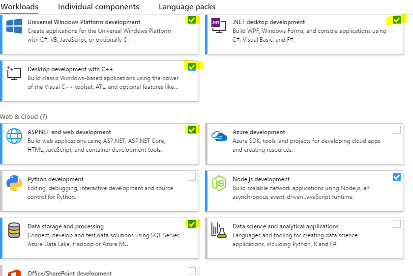
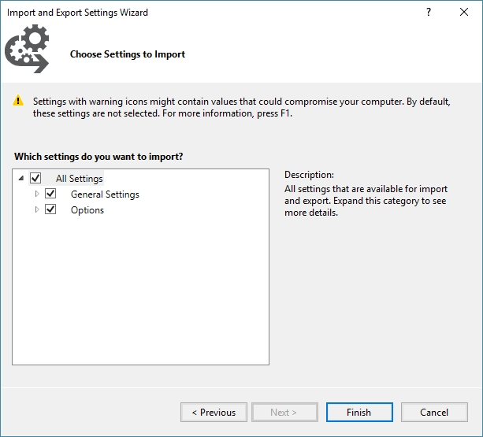
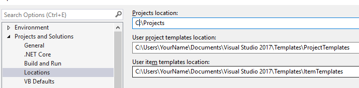

# Setting Up Visual Studio

Setting up Visual Studio will take a while and involves many steps.

## Install Visual Studio

1. Download Visual Studio.
    1. Community Edition is freely [available](https://www.visualstudio.com/).
    2. Alternatively you can download the Professional edition of VS through Imagine when it is available. There is no difference between the 2 editions.
2. Install Visual Studio.
    1. Run the setup program. 
    2. Select the following Workloads. *Note: To simplify this process you can use the `template/tools/.vsconfig` file provided to auto-select the workloads.*
        - .NET desktop development
        - ASP.NET and web development
        - Data storage and processing
        - Other workloads may be installed if desired.
        
    3. Finish the installation. This will take a while as most files will need to be downloaded.
3. Run Visual Studio for the first time.
    1. Start Visual Studio. This will take a while the first time.
    2. If prompted for a user account then use your `mytccd.edu` email. You will need to register if you have not yet done so.
    2. When prompted for a profile choose `Visual C#` for this course.
    3. Once Visual Studio has started then everything should be working correctly.
4. Ensure the latest update is installed (this should occur naturally during the installation above).

## Updating Visual Studio

During the initial setup Visual Studio will automatically download any updates. After that you are responsible for applying updates yourself. A flag in the top right corner will indicate if there are updates available.

If any updates are available then click the flag to bring up the `Notifications` window. You can select each update to install. For most extensions selecting it will take you to the `Extensions` window where you can elect to update all the extensions.

Once you have selected the updates to apply you will need to shut down Visual Studio. Note that it is not necessary to apply updates immediately. Updates can take a while to run and Visual Studio cannot be used while they are being applied so defer updates until you can leave your machine idle.

After Visual Studio shuts down it will begin the update process. For extensions an update dialog will appear and, after a while, give you the option to apply the modifications. The extensions will then be updated.

For a Visual Studio update the Visual Studio Installer will start up. Sometimes it has to update itself first. After the installer starts it will begin the update process.

After all updates are applied then you can restart Visual Studio. It may take a minute or so for Visual Studio to clear the flag indicating there are updates.

## Apply Class Settings (Optional)

For this class I am providing a set of default settings for Visual Studio to save you from having to configure everything. These settings are designed to help you use Visual Studio without becoming overwhelmed with the options.

After setting up your [repository](../../github/setup/readme.md) for this course do the following.

1. Start Visual Studio.
2. Click the `Tools\Import and Export Settings` menu item. 
3. Select the `Import selected environment` settings option and click `Next`.
 
4. Select the `No, just import new settings` option and click `Next`. 
5. Using the `Browse` button locate the `template/tools/.vssettings` file in the cloned repository.
6. Ensure that all check boxes are checked and click `Finish`.
 
7.	Visual Studio should now be set up to use the common settings.

To save you time later you may want to have Visual Studio automatically save new projects to your repository you created earlier.

1. Go to `Tools\Options` in the menu.
2. Go to `Projects and Solutions\Location` tab.

3. In the `Projects location` field put the path to the `Labs` folder in your repository. 
4. Click `OK` to save the changes.

## Apply Standard Styling Rules (Optional)

In C# it is important to follow the standard styling rules that other programmers, and the framework itself, follow. To simplify this and help you identify inconsistencies in your code your repository also contains an `.editorconfig` file. This file is set up to enforce most of the standard styling guidelines that C# uses. It also provides some suggestions on using some of the newer language features. 

While writing code the editor will display suggestions, warnings and errors related to the code you are writing and any code that does not follow the settings in the configuration file. None of these warnings or errors will prevent your code from compiling.

Visual Studio will detect this file in your repository as long as your projects are contained within a subfolder. As such you do not need to make any changes for this to work. If you place projects in other locations then you'll want to copy this file into those project folders. 
