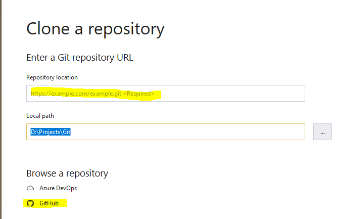
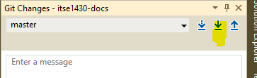
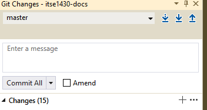
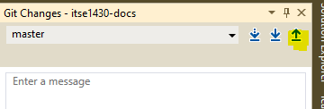

= Getting Started with Github
Michael Taylor <michael.taylor@tccd.edu>
v1.0
:toc:

https://github.com[Github] is the most popular source control system in use today. Github uses the https://git-scm.com/[Git] distributed version control system to manage a series of files stored in it. Git works by tracking differences between changes to a file. This keeps the amount of data needing to be stored at a minimum while allowing for surprisingly complex sets of operations.

NOTE: Git and Github will be used interchangeably here. In most cases the differences are not important. When they are they will be pointed out.

When demonstrating how to perform a task in Github several different options may be shown. You may use the option you are most comfortable with.

Visual Studio's `Team Explorer`::
The default option in current versions of Visual Studio. This is accessible via the `View` menu and is broken up into separate views.
Visual Studio's `Git`::
This is the new option in current versions of Visual Studio. It is still in preview and has some missing features but is focused on Git and easier to work with.
+
NOTE: To use this option you must enable it using `Tools \ Options` and then `Environment \ Preview Features \ New Git user experience`.
Console::
This is useful for quick commands like cloning repositories or updating a branch. It requires using the console window, having Git installed into a location in the path and generally being in the appropriate repository folder.

= Repositories

A `repository` is a collection of files. The repository acts as a container in which operations can be performed on all the files within it. Repositories are generally created to group related files together such as a product for a company or work for a class.

A repository is either a local or remote repository. Remote repositories are stored in Github on the remote server and act as the official source of record for repositories. Local repositories are copies of remote repositories. A machine can have any number of local repositories and even multiple local repositories for the same remote repository provided different folders are used. A remote repository can have any number of local repositories.

A user/account can have any number of repositories. A repository may be publicly visible or private. Private repositories can only be accessed by users allowed by the owner. Public repositories can be read by anyone but modifications can still be restricted if desired.

= Local Repositories

Local repositories are tied to the remote repository through a hidden local folder called `_git`. This folder is created and managed by the `git` tools running on the local machine. This folder is both a cache of the remote repository information but also a set of changes made to the local copy that the remote repository does not have. Deleting or changing this hidden folder will break Git.

Changes may be made to the local repository without impacting the remote repository. Changes are stored locally on the file system. At any point the local changes can be discarded to reset the local repository to the remote repository version. Alternatively the local changes can be staged in preparation for updating the remote repository. Until the remote repository is updated only the local repository can see any changes made. This has a direct impact on how changes are made and is one of the biggest benefits of Git.

WARNING: Never modify or remove the `.git` folder. Doing so will irrevocably corrupt the local repository.

= Change Tracking

Git works by tracking changes to a file. Every file is a distinct entity in Git. Git is able to get all the different versions of a file by replaying the changes made to a file from its original version to whatever change is desired. This makes it historically accurate at the cost of speed and space but in most cases the change tracking is efficient and concise.

Changing a file in Git requires the following steps in most cases.

. Local repository must be created to download the files.
. Changes must be made to the file. These are referred to as local changes.
. Local changes must be committed to the local repository.
. Committed changes must be pushed to the remote repository.

Changes that can be made include adding a file, modifying an existing file or removing a file. Adding a new file simply uploads the initial file with no changes. Modifying an existing file involves differencing the old and new file and uploading the differences. Removing a file involves removing the file from the remote repository. Overall these changes are generally fast.

An important consequence of this approach is that files cannot be renamed. In Git the concept of renaming a file is supported but Github does not support it yet. At a technical level renaming a file involves deleting the old file and creating the new file. Hence Github sees this as a delete and create operation causing the history to be lost. Git supports "renaming" by updating the file with a special flag to indicate the history should be retained.

CAUTION: Always ensure that any changes that should be permanently saved to the remote repository are committed and pushed to the remote repository. Failure to do this will result in data loss if the local repository is removed.

= Folders

Git does not support folders. Since Git only tracks file changes the concept of a folder does not exist. But organizing files into folders is natural for almost every system. At a basic level folders simply provide a unique path from some arbitrary root to a file. In Git a file name can contain a "path" such as `folder\file.txt`. In most UIs the logical folder structure is displayed to make it easier to see files. But the "folder" is strictly a file name convention.

A consequence of this behavior is that Git does not support empty folders. If there are no files with a given "folder" then the folder cannot exist. Another consequence of this is that moving a file from one folder to another is equivalent to renmaing the file.

= Repository Operations

== Authentication

When you connect to Git you must have permissions to perform the action you are requesting. Reads are almost always available to everyone and will work but making changes requires write access. The first time you attempt an operation requiring authentication you should be prompted to log in. Depending upon the credential provider being used the UI will vary. 

=== From Visual Studio

. The `Sign In` UI will be shown. 
. Enter the credentials you created for Github. 
. Click `Sign In`

Visual Studio will then attempt the operation with the provided credentials. If authentication fails then the operation will fail. Use the `Output` window to look for authentication failures. Try the operation again and enter the correct credentials.

=== From Console

. The UI for the configured credential provider will be shown. This may either be directly in the console window or through a Windows UI.
. Enter the credentials you created for Github.
. Depending on the UI either press ENTER or click `Sign In`

If the authentication fails then an error will be shown in the console.

If you receive an access denied or 403 error then this means your user account is incorrect. To correct this sign out of Github and try again.

== Cloning a Repository

Note: Cloning a repository is only necessary the first time a new repository is used on a machine or if the local repository folder is deleted. Thereafter cloning is not necessary.

In order to work with a repository locally you need to clone it. Cloning a repository will set up the structure needed by git and will download the repository to your machine. This will generally only need to be done once per repository per machine. If you ever wipe out the directory structure you will need to repeat this process.

=== From Visual Studio (Git)

. If no solution is curently open then click the `Clone Repository` button in the `Git` window.
. If a solution is open then use the menu option `Git \ Clone Repository`.
. In the `Clone a repository` window do one of the following.
.. Manual
... Enter the URL to the Github repository.
... Verify the local path to be used. It should be named after the repository.
... Click `Clone` to clone.
.. Browse
... Click `Github` to browse the repositories.
... Select the repository to clone.
... Verify the local path to be used. It should be named after the repository.
... Click `Clone` to clone.
. The repository will be cloned but no solution will be opened.


=== From Visual Studio (Team Explorer)

. Click on the `Manage Connections` button in the `Team Explorer` toolbar. It is the "plug" icon.
. You should see a `Local Git Repositories` list with options to `New` \ `Add` \ `Clone` repositories.


. If the repository appears under `Local Git Repositories` then it is already cloned and you do not need to do it again.
. If the repository appears under `GitHub` then you can select it and then click `Clone` to clone it locally.
. Otherwise click the `Clone` option under `Local Git Repositories`.
.. Enter the URL to the repository you are cloning (e.g. https://github.com/myaccount/myrepo). Generally it is best to copy this from the browser address bar while on the root of the repository.
.. The local path will be updated to include the repository name. If the local path is not correct then you can adjust it in the `Tools \ Options` in Visual studio.
.. If the local path does not match the repository name then it likely already exists and does not need to be cloned again.
.. Click `Clone` to clone the repository.


=== From Console

. Using the console go to a folder that does not have any repository.
. Enter the command `git clone` and the URL to the repository.
[source,shell]
----
git clone https://github.com/myuser/myrepo
----

== Opening a Repository

When opening Visual Studio back up you will need to open the repository containing your code.

NOTE: This is only necessary if you don't use the `Recent` list to open an existing solution. When opening a solution it will automatically connect back to the repository.

=== From Visual Studio (Team Explorer)

. Click on `Manage Connections`. 
. You should see a `Local Git Repositories` list with options to `New \ Add \ Clone` repositories.
. The repositories you have already cloned will appear. 
. Double click the desired repository to open it.

Visual Studio will now be connected to the repository. To save you some time Visual Studio will return to the home page for Team Explorer. At the bottom of the page is a list of the solutions you have in the repository. You can either double click the desired solution (if it already exists) or create a new solution. 

Because you have a repository open all changes will be tracked. It is strongly recommended that you pull your repository before making any further changes.

NOTE: It is critical that you keep all changes in your repository within the folder structure of your repository. Failure to do so will cause Git to miss the changes.

== Pull a Repository

After opening a repository you should pull down any changes. Pulling a repository will download any changes from Git to your local copy. Since Git tracks changes only those differences need to be downloaded. It is important that you do this before making any other changes otherwise you may run into merge issues with pushing changes later.

NOTE: Always pull your repository before starting any work to ensure you do not run into issues pushing your changes later.

CAUTION: You cannot pull a repository if you have any local changes uncommitted.

=== From Visual Studio (Git)

. In `Git` select the `Pull` command in the top right of the window.
+


=== From Visual Studio (Team Explorer)

. From the home tab of Team Explorer click the `Sync` option.
+

. On the `Synchronization` tab click the `Pull` link to pull down any changes. It doesn't matter which `Pull` link you use.
. Git will report any changes that were downloaded.

=== From Console

Go to the folder containing the repository and run the following command.
[source,shell]
----
git pull
----

You can now make changes to your repository knowing you have the latest version locally. Any changes made by others (or yourself on another machine) will now be available locally.

== Pushing Changes

When you have made the changes are want to make them permanent you need to commit them and then push them to Git. Git follows a 2-step process for pushing changes. The first step commits the changes from your working folder to a local copy. At this point the changes are not available in Git but will be part of the changes that are sent. The second step is to push the changes. This will copy any commits from your local machine to Git. Once pushed others will have access to your changes. 

NOTE: This two step process always occurs but since you will often commit and push at the same time Visual Studio provides a shortcut command to do both at once.

=== From Visual Studio (Git)

. Go to the `Git` window.
+

. Git will analyze the differences between the files since your last commit. Any differences will be listed. At this point you can undo changes you've made or commit your changes.
. To commit the changes you must enter a comment about what changes you've made. This information will be available later to explain why the changes were made.
. Since you will often be committing and pushing the changes together click the drop down arrow next to the `Commit All` button and select ```Commit All and Push```. This will commit and then push the changes at once.
. Assuming everything is successful then Git will be updated with your changes. 

=== From Visual Studio (Team Explorer)

. From the home tab of Team Explorer click the `Changes` option.
+

. Git will analyze the differences between the files since your last commit. Any differences will be listed. At this point you can undo changes you've made or commit your changes.
. To commit the changes you must enter a comment about what changes you've made. This information will be available later to explain why the changes were made.
. Since you will often be committing and pushing the changes together click the drop down arrow next to the `Commit All` button and select ```Commit All and Push```. This will commit and then push the changes at once.
. Assuming everything is successful then Git will be updated with your changes. 


=== From Console

Go to the folder containing the repository and run the following command.

[source,shell]
----
git add .
git commit -m "message"
git push
----

=== Pushing Changes after Commit

On occassion the commit and push may fail because of a merge conflict or for other issues. In this case the files have been committed locally and therefore no longer appear under the `Changes` tab. In this case you will need to resolve the issue and try to push again. To push an existing committed change do the following.

=== From Visual Studio (Git)

. From the `Git` window click the `Push` button in the top right corner.
+


=== From Visual Studio (Team Explorer)

. From the home tab of Team Explorer click the `Sync` option.
+

. Under the `Outgoing Commits` section you will see one or more commits that have not successfully been pushed yet.
+

. To push all the outgoing commits click the `Push` link. This will attempt to push the commits again.

=== From Console

Go to the folder containing the repository and run the following command.

[source,shell]
----
git push
----

=== Merge Conflicts

If you try to push changes to Git and one of the files that has changed was modified elsewhere and you didn't pull the changes first then you will get a merge conflict. In most cases you will need to manually merge the changes. 

. Pull the changes from GitHub.
. For each conflict either accept the curent/local version, accept the incoming/server version or merge the changes manually.
. Commit the merge changes.
. Try pushing again.

=== Common Push Issues

In general errors will occur when pushing if they are going to occur. That is because you are trying to communicate with Git. There are several common issues that can occur. 

The first step in diagnosing the issue is looking in the `Team Explorer` window at the error that is displayed. It will often explain the exact issue. The other place to look is in the `Output` window of Visual Studio under the `Source Control - Git` category.

== Undoing Changes

Sometimes you make changes that you want to revert. It is important to note that you need to undo changes before you have committed them. Once changes are committed (or pushed) it becomes more difficult to undo them.

=== From Visual Studio (Git)

. To undo several changes.
.. Go to the `Git` window.
.. For each change you want to undo select the file (or the entire folder) and select `Undo`.
... If the change was an addition then select `Delete`. Alternatively you can also go to the file system and simply remove the file/folder that you added.
... Some times you have to undo changes and then delete them.
. To undo changes to a single file (modifications only). 
.. Right click the file in `Solution Explorer`.
.. Select the `Undo` option to undo the changes.

=== From Visual Studio (Team Explorer)

. To undo several changes.
.. Go to the `Changes` tab in `Team Explorer`.
.. For each change you want to undo select the file (or the entire folder) and select `Undo`.
... If the change was an addition then select `Delete`. Alternatively you can also go to the file system and simply remove the file/folder that you added.
... Some times you have to undo changes and then delete them.
. To undo changes to a single file (modifications only). 
.. Right click the file in `Solution Explorer`.
.. Select the `Undo` option to undo the changes.

== See Also

link:../readme.adoc[Getting Started] +
link:/setup/readme.adoc[Setting Up]