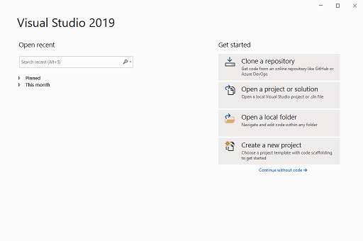
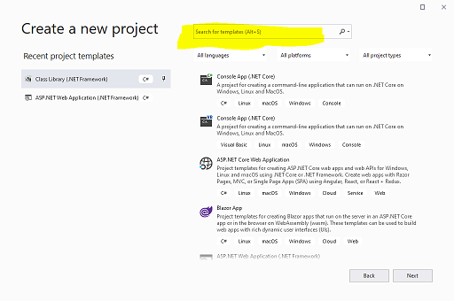
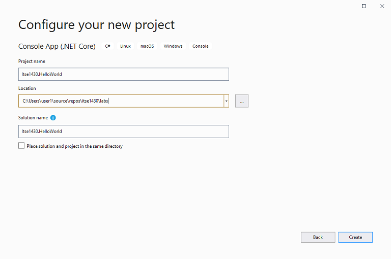

= Creating a Solution
Michael Taylor <michael.taylor@tccd.edu>
v1.0

Creating a link:solutions.adoc[solution] in Visual Studio can seem overwhelming until you walk through it a couple of times.

NOTE: These steps assume you are starting with a new Visual Studio instance. If you already have Visual Studio open then you can get to the same ??

. Start Visual Studio.
. In the `Start Window` selec the `Create a new project` option.
+

. In the `New Project Dialog` search for the project to create either using the search field in the upper right or by scrolling through the list of available projects on the right side.
+

+
NOTE: Recent project types will be displayed on the left side.
. Select the project type to move to the `Configure Project` window.
. Configure the project settings.
.. The `Project name` should be unique and descriptive of what the project represents (e.g. `Itse1430.HelloWorld`). 
+
WARNING: The project name must be a valid identifier otherwise it will cause issues.
.. The `Location` should be the path where the project is saved.
+
NOTE: When adding a project to an existing solution you cannot change the location.
WARNING: When using Github ensure the project is stored in the Github repository (e.g. `c:\users\<username>\source\repos\itse1430\labs`) otherwise it will not be committed to Github.
.. The `Solution` will default to the project name but generally should be changed to a name that represents the product being built (e.g. `HelloWorld`).
+

. Click `Create` to create the project. Once done the solution and project will be open in Visual Studio.

== See Also

link:solutions.adoc[Solutions and Projects]