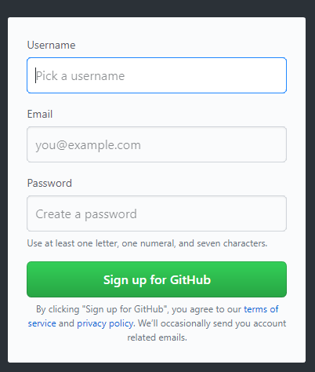
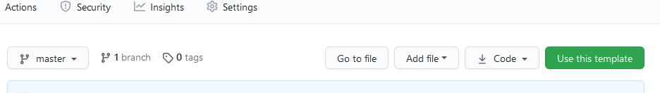
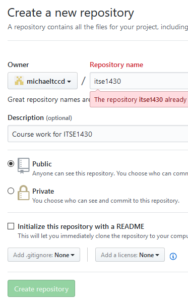

= Setting Up GitHub
Michael Taylor <michael.taylor@tccd.edu>
v1.0
:toc:

This class requires a https://github.com[Github account] for storing all class work and for submitting labs. You must set up a repository in order to complete the work in this class.

WARNING: No assignments will be accepted that are not in Github. Classwork will be done through Github only. No exceptions will be made.

== Creating an Account

NOTE: If you already have a Github account you may continue to use it.

. Go to https://github.com[Github] in your browser.
. You will be prompted to create an account. If not then click `Sign up` in the top right corner.
+

. Enter a username (ex. `Mynametccd`).
+
WARNING: The user name is publicly visible and part of all URLs. You should not use a sensitive or personal user name.
. Enter your MyTccd email address.
. Enter a password.
. Click `Sign up for GitHub`.

After signing up you Github will send a verification email that you must verify before your account is active.

== Creating the Class Repository

You need a repository to work with Github. A repository is a collection of files. For this class you will have a repository for the work we do during the semester. Both your in class work and lab assignments will be placed here.

NOTE: Even if you had an existing Github account you must create a new repository for this course.

There are several ways to create a repository: create a new one, import a template repository, fork an existing repository or link:gettingstarted/github/readme.adoc[clone] a repository. For this class you will import the template repository already created.

To import the template repository do the following.

. Make sure you are logged into Github with your TCCD account.
. Go to the template repository URL - https://github.com/michaeltccd/itse1430-template
. You should see an option to `Use this template` at the top of the repository just before the list of files.
+

. Click the `Use this template` button to create a new repository.
+

. Enter the repository name (use `itse1430`).
. Enter an optional description such as `ITSE 1430 Programming in C#`).
. Set the repository as `Public`.
. Click the create button to create the repository.

After the repository has been set up you do not need to do anything else. You now have your own copy of the class repository. 

WARNING: Once you have created your repository and submitted your first lab assignment you will not be allowed to change the repository for labs. Only a single repository will be used for the entire semester. If you have issues getting your existing repository to work then contact the instructor for assistance.

== A Note on Repository Names

To avoid confusion the following terms will be used.

Class Repository::
The repository that the instructor uses during class and which contains classwork and labs as the instructor updates things. You will never write to this repository. You will generally link:/quickstart/github/readme.adoc[pull] from this repository when you need to update your local copy of the classwork.
Documentation Repository::
The repository where the documentation and book reside. The instructor will maintain this repository. You can refer to it online when you need to read up on anything presented in class.
Your Repository::
The repository you just created. This repository is where you will save all your changes. You will generally synchronous this repository on any machines you work from.

== See Also

link:/gettingstarted/readme.adoc[Getting Started] +
link:../readme.adoc[Setting Up]
