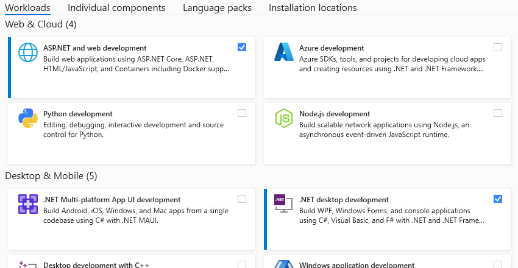
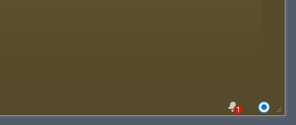
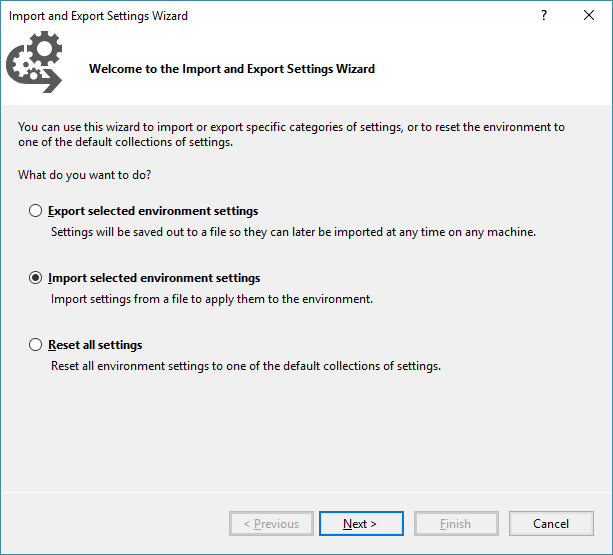
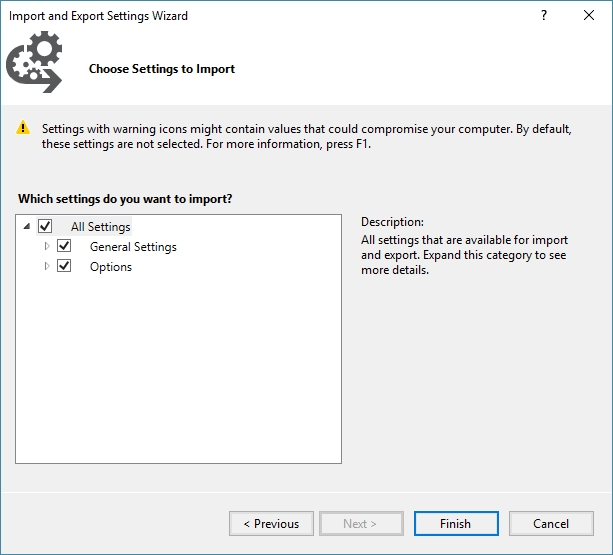

= Setting Up Visual Studio
Michael Taylor <michael.taylor@tccd.edu>
v1.1
:toc:

CAUTION: Setting up Visual Studio will take a while and requires a persistent internect connection. Be sure that you have a stable network connection, sufficient power and enough hard drive space before continuing.

NOTE: Screenshots may vary a little from what you actually see.

== Download Visual Studio

There are several editions available but you must ensure you use the version listed in the course requirements. Community Edition is free and can be downloaded https://visualstudio.microsoft.com/vs/community/[here]. 

NOTE: If you already have a copy of Visual Studio (of the correct version) installed then you can use it instead but you may need to install additional components.

== Install Visual Studio

. Run the setup program. 
. Select the following Workloads. Alternatively ou can use the `template/tools/.vsconfig` file provided in your own repository to auto-select the workloads.
   - ASP.NET and web development
   - .NET desktop development   
   - Data storage and processing
   - Other workloads may be installed if desired.
+

. Change the `Location` if you want to put Visual Studio in a different directory.
. Finish the installation. This will take a while as most files will need to be downloaded.

== Start Visual Studio

Start Visual Studio. If this is the first time you will be prompted for a user account. Use your existing `mytccd.edu` email. You will need to register if you have not yet done so.

When prompted for a profile choose `Visual C#` for this course. Once Visual Studio has started then everything should be working correctly.

== Updating Visual Studio

During the initial setup Visual Studio will automatically download any updates. After that you are responsible for applying updates yourself. A flag in the bottom right of the status bar will indicate if there are updates available.

If any updates are available then click the flag to bring up the `Notifications` window. You can select each update to install. For most extensions selecting it will take you to the `Extensions` window where you can elect to update all the extensions.

Once you have selected the updates to apply you will need to shut down Visual Studio. Note that it is not necessary to apply updates immediately. Updates can take a while to run and Visual Studio cannot be used while they are being applied so defer updates until you can leave your machine idle.

After Visual Studio shuts down it will begin the update process. For extensions an update dialog will appear and, after a while, give you the option to apply the modifications. The extensions will then be updated.

For a Visual Studio update the Visual Studio Installer will start up. Sometimes it has to update itself first. After the installer starts it will begin the update process.

After all updates are applied then you can restart Visual Studio. It may take a minute or so for Visual Studio to clear the flag indicating there are updates.

== Apply Class Settings

For this class I am providing a set of default settings for Visual Studio to save you from having to configure everything. These settings are designed to help you use Visual Studio without becoming overwhelmed with the options.

NOTE: This is optional but highly recommended. This will ensure that your configuration of Visual Studio matches what will be used in class.

After setting up your Github repository do the following.

. Start Visual Studio.
. Click the `Tools\Import and Export Settings` menu item. 
. Select the `Import selected environment` settings option and click `Next`.
+

. Select the `No, just import new settings` option and click `Next`. 
. Using the `Browse` button locate the `template/tools/*.vssettings` file in your class repository.
. Ensure that all check boxes are checked and click `Finish`.
+

.	Visual Studio should now be set up to use the common settings.

NOTE: For this class your lab assignments will go into the `labs` subfolder of your repository. You will need to ensure you change to this subfolder when creating projects.

== See Also

link:/gettingstarted/readme.adoc[Getting Started] +
link:../readme.adoc[Setting Up]
