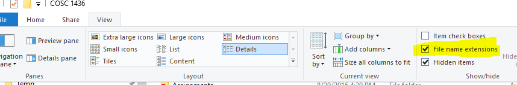
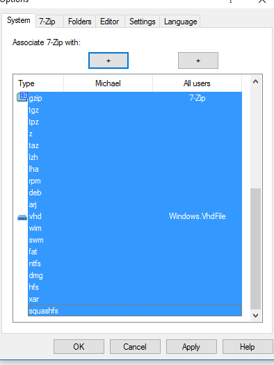
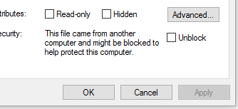

= Setting Up Windows
Michael Taylor <michael.taylor@tccd.edu>
v1.0
:toc:

Windows is designed for a novice user. Programming is considered an advanced scenario and therefore the default Windows settings and programs are not ideal. The following are recommended changes you make to your computer to simplify your programming efforts.

== Show File Extensions

Out of the box Windows does not show the file extension.
Most files have a file extension that help identify the type of file but users are generally not concerned with this. 
Showing the file extensions helps avoid accidentally changing the wrong files.

. Open `Windows Explorer` (not Internet Explorer).
. For Windows 10
.. Go to the `View` tab in the ribbon bar.
.. Check the option `File name extensions`
+

. For older Windows versions
.. Press the Alt key to bring up the menu for Explorer and select `Tools \ Options`
.. Go to the `View` tab.
... Uncheck the option `Hide file extensions for known file types`.

All files shown in Windows Explorer will now show the (generally 3 letter) file extension after the file name (ex. Explorer.exe).

== Install an Archiving Program

Windows ships with built in support for archive (.zip) files but there are several problems with it. For one it is really slow even for small files. Secondly it shows the file as a folder which gives you the illusion of it actually being a folder in which you can double click files. But this rarely works and more likely will cause errors so replacing the standard Windows archive program with a better one is recommended. 

One freely available and solid program is https://www.7zip.org)[7-Zip]. I recommend that you install it (or another tool).

. Download the https://www.7zip.org[program]. For most computers the 64-bit exe version is the correct version.
. Run the setup program to install it. 
+
WARNING: Free programs tend to offer additional software during their installation. Read each screen carefully and only install the core program. Do not install additional software such as Yahoo Toolbar or Bing, etc.
. After installation start the program as an administrator (right click the icon and select Run as Adminstrator).
. Go to `Tools \ Options`.
. Select all the files in the list (click the first item, hold down Shift and click the last item) and  then click either the option to associate all files just for you or for all users. Then click Apply. 
+

. Now when you are working with any .zip file it will use 7-zip. To extract a .zip file right-click and select one of the Extract menu options.

== Install a Text Editor Program

Windows ships with a couple of text editors and you likely also have Word but they are either too simple or too complex. 
There are many freely available text editors but I recommend https://notepad-plus-plus.org/[Notepad++] for its low overhead and large support for programming languages.

. Download the https://notepad-plus-plus.org/[program].
. Run the setup program and install the software.
+
WARNING: Free programs tend to offer additional software during their installation. Read each screen carefully and only install the core program. Do not install additional software such as Yahoo Toolbar or Bing, etc.
. Right-click any text file and select the option to open in Notepad++. 

It is recommended that you set Notepad++ as the default program for most text files.

== Blocked Files

Windows is designed to be secure by default.
When downloading a file from the Internet Windows may mark the file as blocked. This is to protect you from running dangerous files.
In general, trying to access a blocked file will fail.
To check whether a file is blocked or not do the following.

. Open `Windows Explorer` and locate the file.
. Right click the file and select `Properties`.
. On the `General` tab, if the file is blocked you will see a message about it being blocked and an option to unblock it. 
+

. Click the option to unblock the file.

== See Also

link:/setup/github/readme.adoc[Setting Up Github]
link:/setup/visualstudio/readme.adoc[Setting Up Visual Studio]